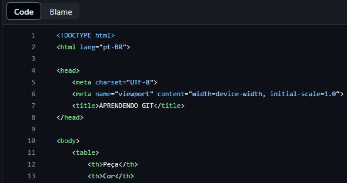

# Arquivo de teste README.md
Um projeto de teste com um arquivo README📖



## Tecnologia utilizada

-HTML


## Como Utilizar

1- Clone pro projeto

```
git clone <url>
```

2- Acesse a pasta do projeto

```
cd learn-git
```